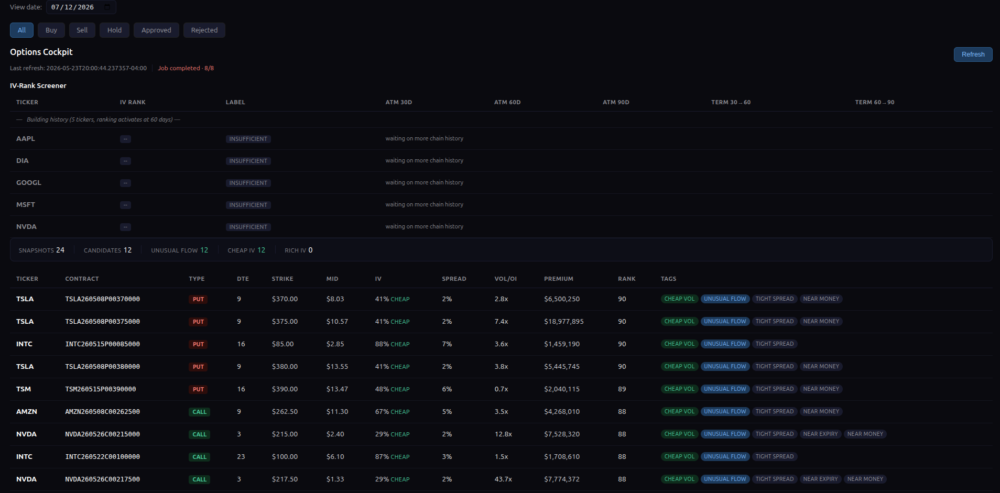
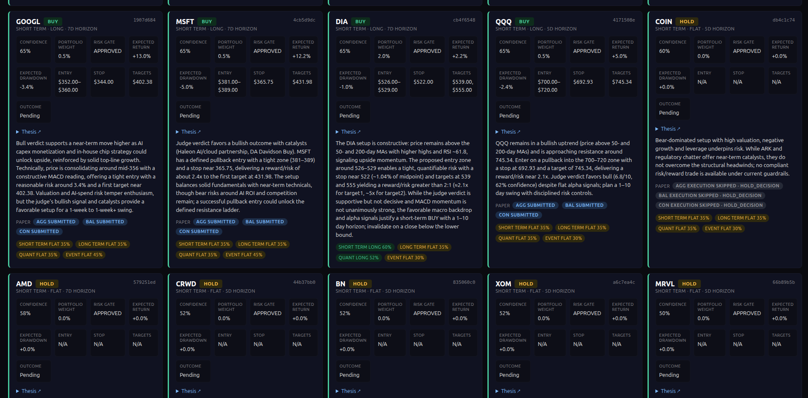
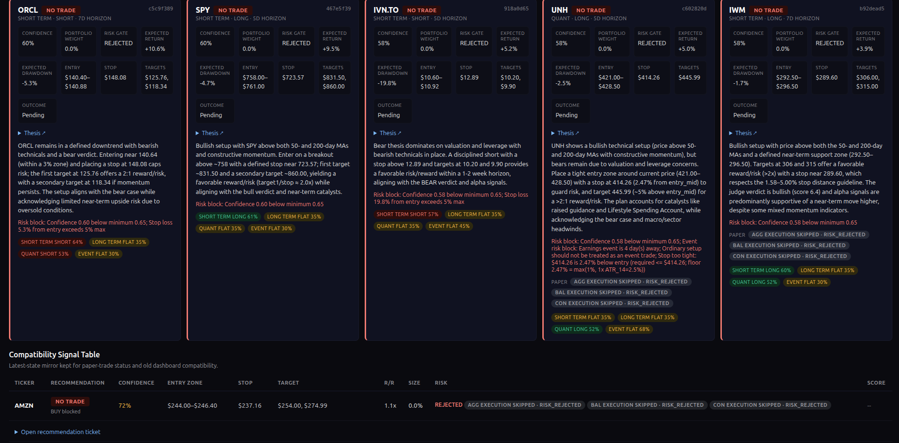
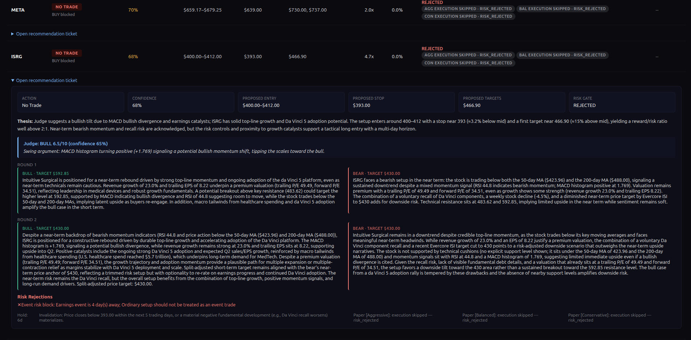
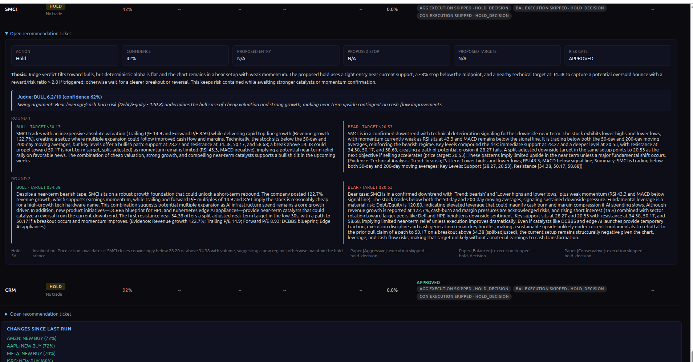

# Quorum

**A hedge-fund investment committee running on your laptop.**

Quorum is a multi-agent equity research tool. Every morning before the
market opens, a team of LLM-powered analysts debate each ticker — bull vs. bear,
synthesized by a trader, approved by a risk manager — and produce actionable
signals with precise entry, exit, and stop levels. Signals are validated by
paper trading against real broker accounts, and a Wave 2 options layer expresses
the highest-conviction theses as options positions.

It's a single-user, localhost-only research tool — a trader's terminal, not a
SaaS platform.

> **Disclaimer.** This is a personal research and educational project. It is
> **not financial advice**, not a recommendation to buy or sell any security,
> and comes with no warranty. Markets are risky; you are solely responsible for
> any decisions you make. Paper trading only unless you explicitly wire up live
> credentials — which is not recommended.

---

## How it works

The core pipeline is a [LangGraph](https://github.com/langchain-ai/langgraph)
state machine that processes one ticker at a time:

```
data → analysts → researchers (multi-round debate) → judge → trader
     → risk manager → compose signal → execute paper trades → END
```

- **Analysts** (`agents/analysts/`) — four specialized voices: `technical`,
  `fundamentals`, `news`, and `sentiment`.
- **Researchers** (`agents/researchers/`) — a `bull` and a `bear` argue over
  multiple rounds, then a `judge` renders a verdict.
- **Trader** (`agents/trader.py`) — synthesizes the debate into a directional
  decision with entry/exit/stop.
- **Risk manager** (`agents/risk_manager.py`) — enforces confidence floors,
  reward/risk ratios, stop limits, and sector concentration before anything is
  persisted.
- **Recommendation engine** (`recommendation/`) — alpha models (long, short,
  event, quant), calibration, portfolio construction, and a scored track-record
  ledger.
- **Options layer** (`options/`) — IBKR/OPRA chain fetching, Greeks, IV-rank
  screening, protective-cost analysis, and thesis generation (Wave 2).
- **Paper trading** (`agents/paper_trader.py`) — executes validated signals
  against Alpaca paper accounts across three strategies (Aggressive, Balanced,
  Conservative), each with its own sizing and drawdown breaker.

Results are served through a FastAPI dashboard and API, and a scheduler runs the
whole pipeline automatically before market open.

### The dashboard

A few views of the localhost dashboard the pipeline feeds:


*The **Options Cockpit** (Wave 2 options layer): an IV-rank screener building history across the ticker universe, plus a scored candidate table — DTE, strike, mid, IV, bid/ask spread, volume/OI, and premium — tagged for cheap vol, unusual flow, tight spread, and near-money contracts.*


*The **signal board**: one card per ticker with the recommendation (BUY / HOLD), confidence, portfolio weight, risk-gate status, and precise entry / stop / target levels — plus a plain-English thesis and per-strategy paper-trade submission status (Aggressive / Balanced / Conservative).*


*Signals the **risk manager rejected** (NO TRADE): each card shows the exact reason a trade was blocked — confidence below the floor, stop distance over the cap, or an earnings-event conflict. The Compatibility Signal Table at the bottom mirrors latest-state for paper-trade tracking.*


*An expanded **recommendation ticket** (ISRG): the judge's verdict and confidence, followed by the full multi-round bull-vs-bear debate with each side's price target, and the risk rejections that gated it.*


*Another expanded ticket (SMCI) showing the round-by-round debate and swing argument, with the **Changes Since Last Run** panel highlighting newly promoted BUY signals across the universe.*

### LLM routing

Analysts can run **local** (via [Ollama](https://ollama.com) or `llama.cpp`),
**cloud** (OpenAI), or **deterministic** (fast rule-based). Each mode has a
configurable fallback, so the pipeline degrades gracefully instead of failing.

## Tech stack

- **Python** · **FastAPI** + Uvicorn · Jinja2 templates
- **LangGraph** / LangChain for agent orchestration
- **PostgreSQL** (via `psycopg`) for storage
- **yfinance**, **Alpha Vantage**, **Alpaca**, and **IBKR** (`ib_async`) for data
- **pandas** / **numpy** / **ta** for analysis
- **pytest** for the test suite

## Getting started

### Prerequisites

- Python 3.11+
- PostgreSQL running locally
- (Optional) [Ollama](https://ollama.com) for local LLM analysts
- (Optional) API keys for OpenAI, Alpha Vantage, Alpaca, and an IB Gateway for
  options data

### Setup

```bash
# 1. Clone and create a virtualenv
git clone https://github.com/mimiandsunny/Quorum.git
cd Quorum
python -m venv .venv && source .venv/bin/activate

# 2. Install dependencies
pip install -r requirements.txt
# (optional) local llama.cpp backend:
# pip install -r requirements-llamacpp.txt

# 3. Configure environment
cp .env.example .env
#   → edit .env with your API keys and database URL

# 4. Create the database
createdb stockinvest   # or point DATABASE_URL at an existing one

# 5. Run the app (tables are created on first boot)
python main.py
```

The dashboard is served at **http://127.0.0.1:8000**.

### Running the scheduled pipeline

`main.py` serves the web app; `scheduler.py` runs the analysis pipeline on a
schedule (default 6:30 AM ET on market days) plus scoring, reconciliation, and
end-of-day close jobs:

```bash
python scheduler.py
```

You can also trigger a run manually from the dashboard or via `POST /api/run`.

### Tests

```bash
pytest
```

## Configuration

All configuration lives in `.env` (loaded by `config.py` via
`pydantic-settings`). See [`.env.example`](.env.example) for the full,
documented list. Highlights:

| Setting | What it controls |
| --- | --- |
| `ANALYST_MODE` | `local` / `cloud` / `deterministic` analyst backend |
| `LOCAL_PROVIDER` / `LOCAL_MODEL` | Ollama or `llama_cpp` model selection |
| `PAPER_TRADING_ENABLED` | Explicit opt-in for Alpaca paper execution |
| `OPTIONS_DATA_PROVIDER` | `ibkr` (preferred) or `yfinance` fallback |
| `DATABASE_URL` | PostgreSQL connection string |

The ticker universe and all risk thresholds (confidence floors, R/R caps,
position sizing tiers, drawdown breakers) are defined with inline documentation
in [`config.py`](config.py).

## API reference

The FastAPI app exposes the dashboard at `/` plus a JSON API, including:

- `GET  /api/signals` — latest signals
- `POST /api/run` — trigger a pipeline run · `POST /api/run/stop`
- `GET  /api/recommendations` — recommendation engine output
- `GET  /api/recommendation_track_records` — scored performance ledger
- `GET  /api/options/dashboard` · `GET /api/options/screener`
- `POST /api/options/refresh` — async options-chain refresh (job-based)
- `GET  /api/paper_trades` · `GET /api/metrics`

## Project layout

```
agents/          Multi-agent pipeline (analysts, researchers, trader, risk)
recommendation/  Alpha models, calibration, portfolio, track-record ledger
options/         Options chain, Greeks, screener, thesis (Wave 2)
data/            Data pipeline, models, storage, universe/watchlist
templates/       Dashboard UI
tests/           pytest suite
main.py          FastAPI app + API routes
scheduler.py     APScheduler jobs (pipeline, scoring, reconciliation, EOD)
config.py        All settings (pydantic-settings, reads .env)
DESIGN.md        Design system / UI source of truth
```

## License

This project is licensed under the MIT License — see the [LICENSE](LICENSE) file
for details.
